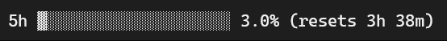
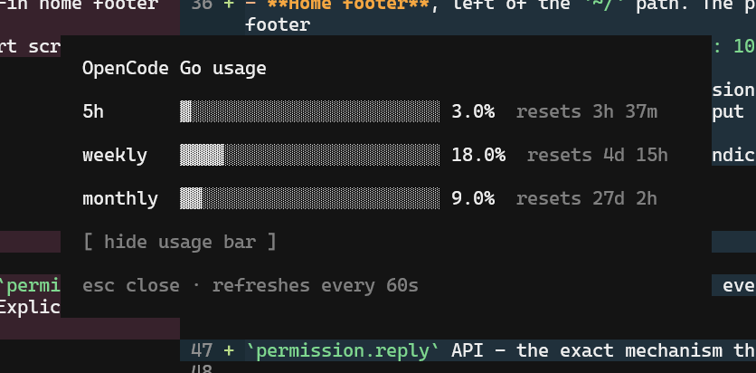

# opencode-usage-bar

[OpenCode Go](https://opencode.ai/docs/go/) usage bars for the [opencode](https://opencode.ai) v2 TUI - a persistent bar next to the prompt in sessions, plus a `/limit` popup with all three windows. Read-only; talks directly to the official usage API, never sends LLM prompts.

<div align="center">


<br />


<br />

<a href="https://www.buymeacoffee.com/leogimpel"></a>

</div>

## Install

```sh
npm install -g @leo.gimp/opencode-usage-bar
```

Then quit and restart opencode - CLI plugin config is only read at startup. The postinstall script copies the plugin to `~/.config/opencode/usage-bar/`, vendors its dependencies, and patches `~/.config/opencode/cli.json` (the V2 terminal settings file) with the absolute path under `plugins`.

> npm 11+ gates install scripts by default. If the postinstall was skipped, re-run with `npm install -g @leo.gimp/opencode-usage-bar --allow-scripts=@leo.gimp/opencode-usage-bar`, or run the `opencode-usage-bar` bin manually.

To uninstall, remove the entry from `cli.json` and delete `~/.config/opencode/usage-bar/`.

## Features

### Session usage bar

A full usage bar rendered on the right side of the prompt hint row (the same row as
`agent · model · provider · effort`), inside active sessions:

- Percent used, one decimal (`xx.x%`), 20-character `▓/░` bar, reset countdown (`4h 10m`, `3d 4h`, …)
- Refreshes automatically every **60 seconds** (with in-flight request deduplication and a 60s response cache)
- **Adaptive sizing** - mirrors opencode's own session layout (sidebar width, prompt padding)
  and terminal size, re-evaluated live on window resize:

  | Space available | Display |
  |---|---|
  | Plenty | full bar + percent + reset timer |
  | Tight | compact form `5h ▓▓░░░░░░ 11.0%` (no timer) |
  | Not enough | hidden - it never wraps or overlaps the prompt hints |

- Only shown once you are inside a session, not on the home or fresh-session screen
- Shows a dimmed `5h (unavailable)` if the request fails instead of silently disappearing



### `/limit` popup

Type `/limit` (or `ctrl+p` → *Usage limits*) for a popup with all three OpenCode Go windows -
rolling 5h, weekly, and monthly - each with a bar, percent used, and reset timer:

- Fetches **fresh** data every time it opens (bypasses the 60s cache)
- Reset timers keep ticking while the popup is open (30s tick)
- Hosted dialog panel, centered over the session; close with `esc`
- `[ hide usage bar ]` toggle below the windows - hides or shows the session prompt bar,
  persisted across restarts in plugin storage (a pre-V2 `~/.config/opencode/usage-bar.json`
  preference is migrated automatically on first run)



### Data source

Reads the official OpenCode Go quota endpoint:

```
GET https://opencode.ai/zen/go/v1/usage
Authorization: Bearer <opencode-go key>
```

returning the rolling (5h), weekly, and monthly windows with percent used and reset times.
The plugin is read-only - it never sends prompts, session data, or anything else to the LLM.

## Options

Passed as the `options` object of the plugin entry in `cli.json`:

| Option | Default | Description |
|---|---|---|
| `left_reserve` | `44` | Columns reserved for the left prompt hints. Increase if the bar hides too late. |
| `sidebar_width` | `42` | Columns reserved for the session sidebar. Set `0` if you keep it hidden (e.g. `session.sidebar: "hide"` in `cli.json`). |
| `padding` | `6` | Prompt box inner padding subtracted from the available width. |

```json
{
  "plugins": [
    {
      "package": "C:\\path\\to\\opencode-usage-bar",
      "options": { "left_reserve": 60 }
    }
  ]
}
```

## Notes

- Without an OpenCode Go key (`OPENCODE_GO_API_KEY` or `opencode-go` in the auth store) the plugin does not start - no bar, no command, nothing registered.
- TUI plugins referenced by npm package spec fail to render (upstream issue [#33884](https://github.com/anomalyco/opencode/issues/33884)) - hence the file-path copy.

## Local development

Add the absolute path to the plugin folder under `plugins` in `~/.config/opencode/cli.json`:

```json
{
  "$schema": "https://opencode.ai/v2/cli.json",
  "plugins": ["C:\\path\\to\\opencode-usage-bar"]
}
```

## Requirements

- opencode **2.x** (uses the V2 CLI plugin slot API, `@opencode/plugin/tui`)
- An OpenCode Go subscription

## License

MIT
